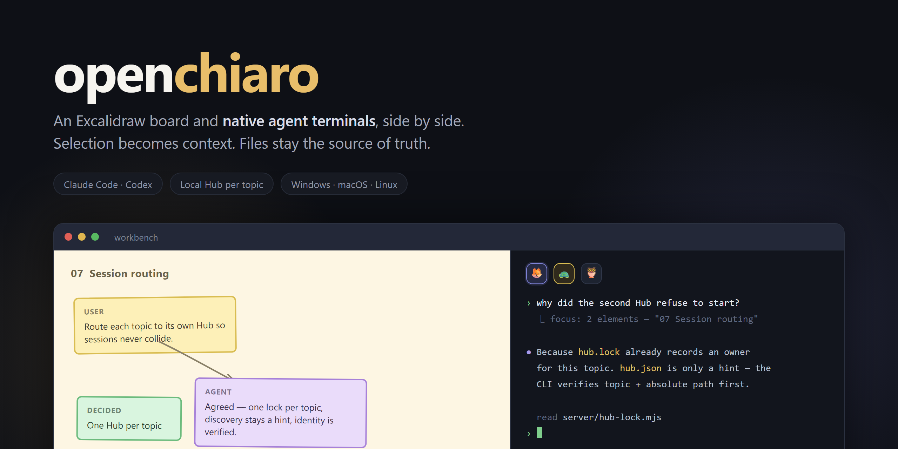

# openchiaro



[简体中文](README.zh-CN.md)

openchiaro is a design-object-driven canvas workbench where humans and AI agents collaborate
through an Excalidraw board and embedded native terminals.

## Core features

- **One local Hub per topic.** Each room is isolated under `chiaro/<topic>/`.
- **Native agent terminals.** Claude Code and Codex run as their real TUI in the browser sidebar.
- **Selection is Focus.** A trusted project hook injects the current canvas selection into the
  next prompt.
- **Files are the source of truth.** Canvas, event log, runtime context, provider session records,
  and topic artifacts remain inspectable local files.
- **Cold resume.** A restarted Hub can lazily resume a recorded provider session and reports when
  it must start fresh.

## Quick start

Requirements: Node.js >= 22.12.0 and a modern browser.

### Recommended: install with npx

```text
npx openchiaro install --target both
npx openchiaro open <topic> --project <project-root>
```

Use `--target claude`, `--target codex`, or an absolute path when only one installation is
needed. On a headless Linux system, add `--no-browser` and open the printed URL manually.

### Developers: run from source

```text
git clone https://github.com/chiaro2048/openchiaro.git openchiaro
cd openchiaro
node --version
npm ci
npm run build
node server/cli.mjs install --target both
node server/cli.mjs open <topic> --project <project-root>
```

The source CLI also supports:

```text
node server/cli.mjs restart <topic> --project <project-root> [--port <start-port>]
```

The default topic is `workbench`. When `--project` is omitted, the repository root is used.

## Connect an AI agent

The user creates or switches agents with the sidebar's `+ Agent` menu and PetDock. Chiaro
starts only server-configured commands and keeps one terminal surface per agent.

Chiaro includes Claude Code and Codex defaults. Override or extend them with
`<project>/chiaro/agents.json`:

```json
{
  "agents": {
    "codex": {
      "cmd": ["codex"],
      "resume": ["codex", "resume", "{sessionId}"],
      "label": "Codex"
    }
  }
}
```

Commands are argv arrays. The browser submits only an agent name and cannot start arbitrary
commands.

To inject canvas Focus and record semantic prompt/turn-end events, merge the provided project
hook example into the provider configuration:

- Claude Code: `hooks/claude-settings.example.json` into
  `<project>/.claude/settings.json`
- Codex: `hooks/codex-hooks.example.json` into
  `<project>/.codex/hooks.json`

Merge with existing hooks; do not overwrite them. Review the command through the provider's
normal trust prompt or `/hooks` view, and do not bypass hook trust.

The product entry point is `npx openchiaro`. [`skill/`](skill/) is an optional context package:
its main file helps an outside agent open a topic, while
[`skill/references/terminal-agent.md`](skill/references/terminal-agent.md) gives the embedded agent
the canvas, conflict, artifact, and Hub contracts.

## Platform support

| Platform | Architectures | Local compiler toolchain |
|---|---|---|
| Windows 10/11 | x64, arm64 | Not required |
| macOS | x64, arm64 | Not required |
| Linux | x64, arm64 | Not required |

`npm ci` selects the prebuilt PTY package for the current OS and CPU.

## License

openchiaro is released under the [MIT License](LICENSE).
